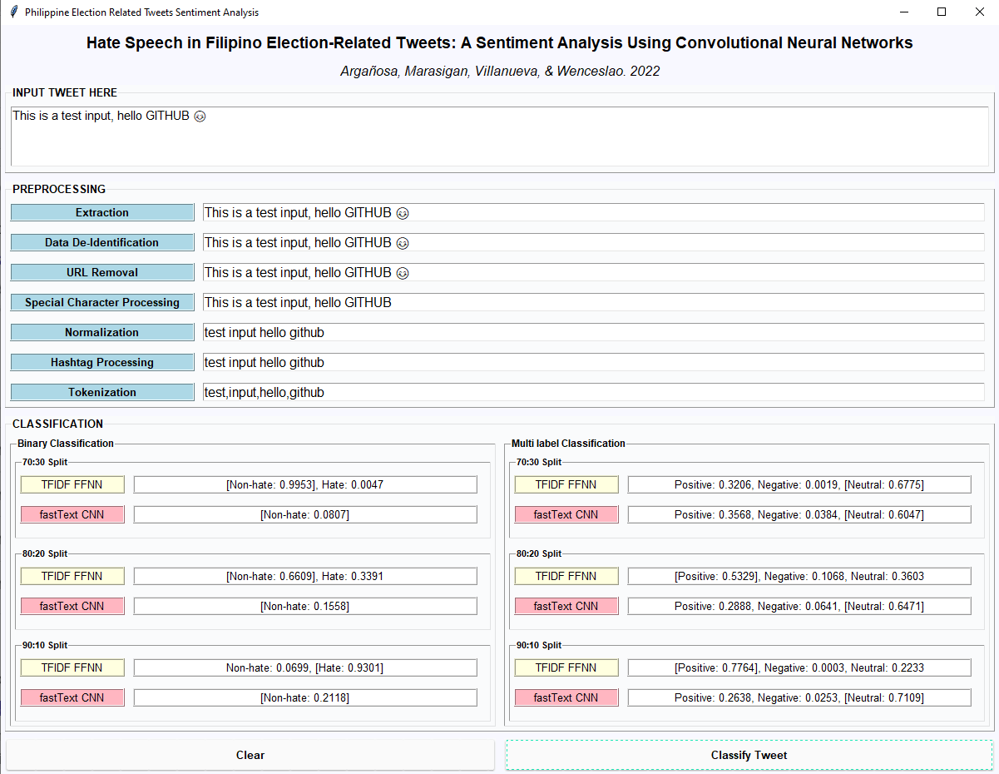

# Hate-Speech-in-Philippine-Election-Related-Tweets
A system implementation of the thesis titled "Hate Speech in Filipino Election-Related Tweets: A Sentiment Analysis Using  Convolutional Neural Networks"

# Authors:
- Argañosa, Sharmaine Crystel D.
- Marasigan, Raphaelle L.
- Villanueva, John Jeco  S.
- Wenceslao, Joan Kirby C.

## GUI

